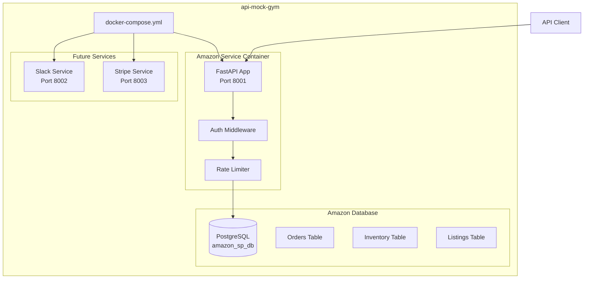
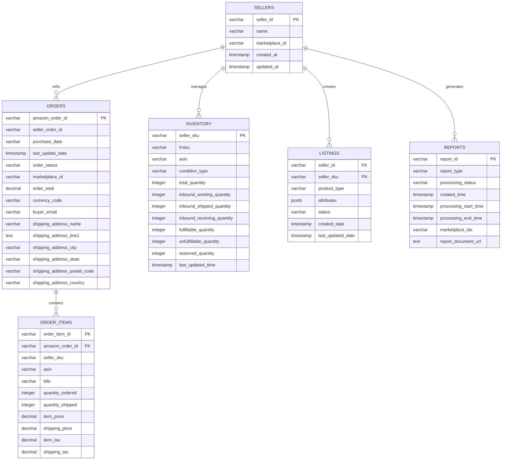
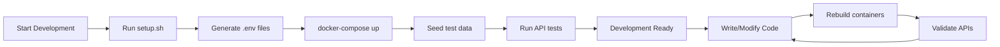

# API Mock Gym - Architecture Plan

## Project Overview

The api-mock-gym is a modular system that creates realistic mock APIs for training language models. Starting with Amazon Selling Partner API, it provides:

- Authentic API endpoints matching real service patterns
- Realistic mock data with proper relationships
- Containerized services with isolated databases
- Scalable architecture for adding new services

## Folder Structure

```
/ (project root)
├── README.md
├── docker-compose.yml
├── .env.template
├── scripts/
│   ├── setup.sh
│   ├── generate-env.sh
│   └── seed-all-data.sh
├── docs/
│   ├── architecture.md
│   ├── api-reference.md
│   └── development.md
├── shared/
│   ├── utils/
│   │   ├── auth.py
│   │   ├── rate_limiter.py
│   │   ├── response_formatter.py
│   │   └── database.py
│   └── models/
│       ├── base_models.py
│       └── error_models.py
└── services/
    └── amazon/
        ├── main.py
        ├── Dockerfile
        ├── requirements.txt
        ├── .env.template
        ├── feed_data.sql
        ├── app/
        │   ├── __init__.py
        │   ├── api/
        │   │   ├── __init__.py
        │   │   ├── v0/
        │   │   │   ├── __init__.py
        │   │   │   ├── orders.py
        │   │   │   └── reports.py
        │   │   ├── 2021-06-30/
        │   │   │   ├── __init__.py
        │   │   │   └── feeds.py
        │   │   └── 2021-08-01/
        │   │       ├── __init__.py
        │   │       └── listings.py
        │   ├── models/
        │   │   ├── __init__.py
        │   │   ├── orders.py
        │   │   ├── inventory.py
        │   │   ├── listings.py
        │   │   └── reports.py
        │   ├── database/
        │   │   ├── __init__.py
        │   │   ├── connection.py
        │   │   └── schemas.py
        │   └── services/
        │       ├── __init__.py
        │       ├── order_service.py
        │       ├── inventory_service.py
        │       └── listing_service.py
        └── tests/
            ├── __init__.py
            ├── test_orders.py
            ├── test_inventory.py
            └── test_listings.py
```

## Core Architecture Components



## Amazon Selling Partner API Mock Design

### Key Endpoints to Implement

1. **Orders API (v0)**
   - `GET /orders/v0/orders` - Get orders
   - `GET /orders/v0/orders/{orderId}` - Get order details
   - `GET /orders/v0/orders/{orderId}/orderItems` - Get order items

2. **Listings API (2021-08-01)**
   - `PUT /listings/2021-08-01/items/{sellerId}/{sku}` - Create/update listing
   - `GET /listings/2021-08-01/items/{sellerId}/{sku}` - Get listing
   - `DELETE /listings/2021-08-01/items/{sellerId}/{sku}` - Delete listing

3. **Inventory API (v1)**
   - `GET /fba/inventory/v1/summaries` - Get inventory summaries
   - `GET /fba/inventory/v1/details` - Get inventory details

4. **Reports API (2021-06-30)**
   - `POST /reports/2021-06-30/reports` - Create report
   - `GET /reports/2021-06-30/reports/{reportId}` - Get report status
   - `GET /reports/2021-06-30/reports/{reportId}/document` - Download report

### Database Schema Design



## Implementation Strategy

### Phase 1: Core Infrastructure
1. Set up project structure and shared utilities
2. Create Docker environment with PostgreSQL
3. Implement authentication middleware (mock LWA)
4. Set up rate limiting and response formatting

### Phase 2: Amazon SP-API Implementation
1. Orders API endpoints with full CRUD operations
2. Inventory management endpoints
3. Basic listings management
4. Reports generation (mock processing)

### Phase 3: Data & Testing
1. Comprehensive mock data generation
2. Unit and integration tests
3. API documentation generation
4. Performance optimization

### Phase 4: Extensibility Preparation
1. Service discovery mechanism
2. Logging infrastructure setup
3. Gateway/proxy preparation
4. Documentation for adding new services

## Key Technical Decisions

1. **Authentication**: Mock Amazon LWA tokens with JWT for consistency
2. **Rate Limiting**: Redis-based rate limiting matching Amazon's limits
3. **Data Generation**: Faker-based realistic data with proper relationships
4. **Error Handling**: Amazon SP-API compliant error responses
5. **Versioning**: API versioning matching Amazon's pattern
6. **Database**: PostgreSQL with proper indexing for performance

## Development Workflow



## Service Configuration

### Amazon Service Environment Variables
- `DATABASE_URL`: PostgreSQL connection string
- `AMAZON_SERVICE_PORT`: Service port (default: 8001)
- `LWA_CLIENT_ID`: Mock LWA client ID
- `LWA_CLIENT_SECRET`: Mock LWA client secret
- `RATE_LIMIT_REQUESTS`: Requests per minute limit
- `REDIS_URL`: Redis connection for rate limiting

### Docker Compose Services
- `amazon-db`: PostgreSQL database for Amazon service
- `amazon-api`: FastAPI application container
- `redis`: Redis for rate limiting and caching
- `postgres-admin`: pgAdmin for database management (development only)

## Next Steps

1. Create the complete project structure
2. Implement shared utilities and base models
3. Build the Amazon Selling Partner API mock service
4. Set up Docker environment and database schemas
5. Generate comprehensive mock data
6. Add testing and documentation
7. Prepare for future service additions

This architecture provides a solid foundation for training language models on realistic API interactions while maintaining modularity and scalability for future enhancements.